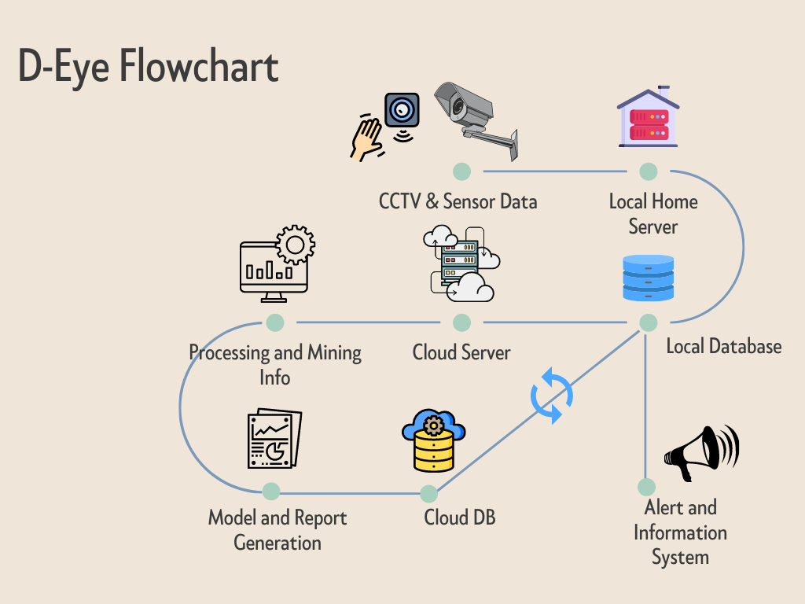

# Security-Management-System aka D-Eye
An Artificial Intelligence based system which is integrated with the digital sensors and CCTV camera results in a more secure environment. The main idea of the AI system is to automate the security of large premises and homes with the smart sensors and cloud systems.

## Project State: 
  The project is in initial stage and the program in this repository is just a small representation of human detection and generating crowd report. The complete version will be uploaded in a month.

